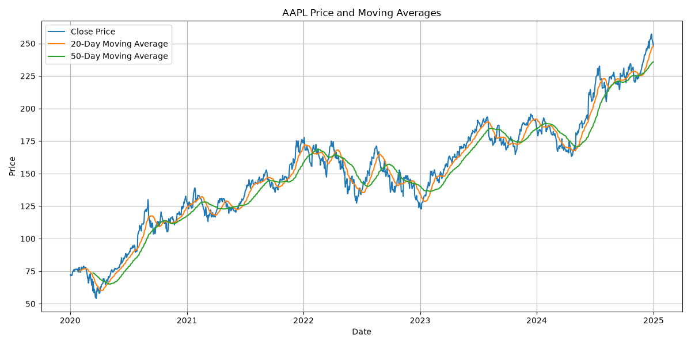
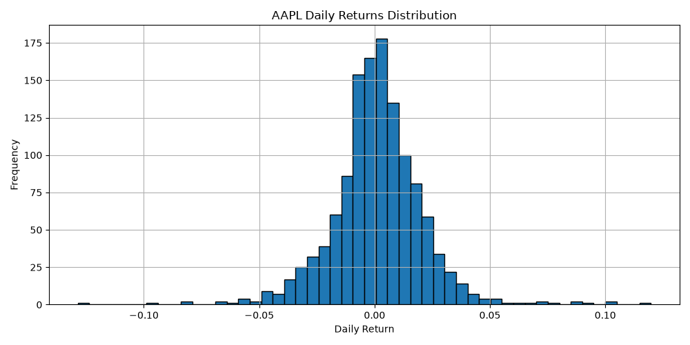
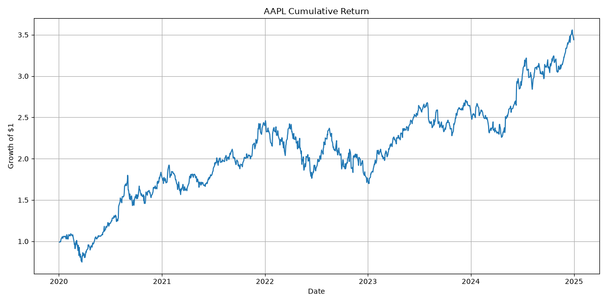
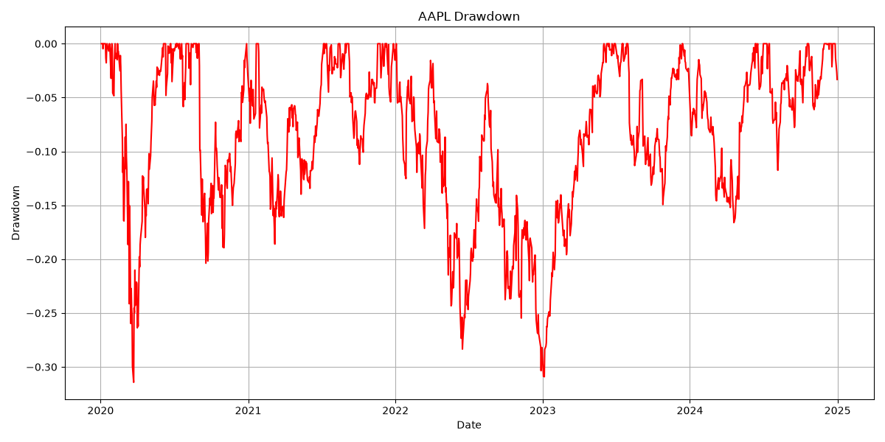

# Stock Price Basic Analysis

## 1. Project Overview
This project analyses historical stock price data using Python, pandas, NumPy, matplotlib, and yfinance.
The goal is to practice basic financial data analysis and understand key concepts.

## 2. Tool Used

- Python
- pandas
- NumPy
- matplotlib
- yfinance

## 3. Data

- Ticker: AAPL
- Start date: 2020-01-01
- End date: 2025-01-01

## 4. Methods

### Daily Return
The percentage change in closing price from one trading day to the next.

### Moving Averages
20-days moving average and 50-days moving averages are used to smooth price movements and observe trends.

### Cumulative Return
The value of an initial investment changes over time.

### Drawdown
The decline from a previous peak. It is useful for understanding downside risk.

## 5. Results

### Price and Moving Averages

### Daily Returns Distribution

### Cumulative Return

### Drawdown

## 6. What I learned

- Downloading financial data
- Working with pandas DataFrames
- Calculating daily returns
- Using rolling windows
- Calculating volatility
- Visualizing financial time series

## 7. Limitations

This project is only a basic historical analysis.

It does not:

- predict future prices
- compare multiple assets
- perform portfolio optimisation
- test trading strategies

