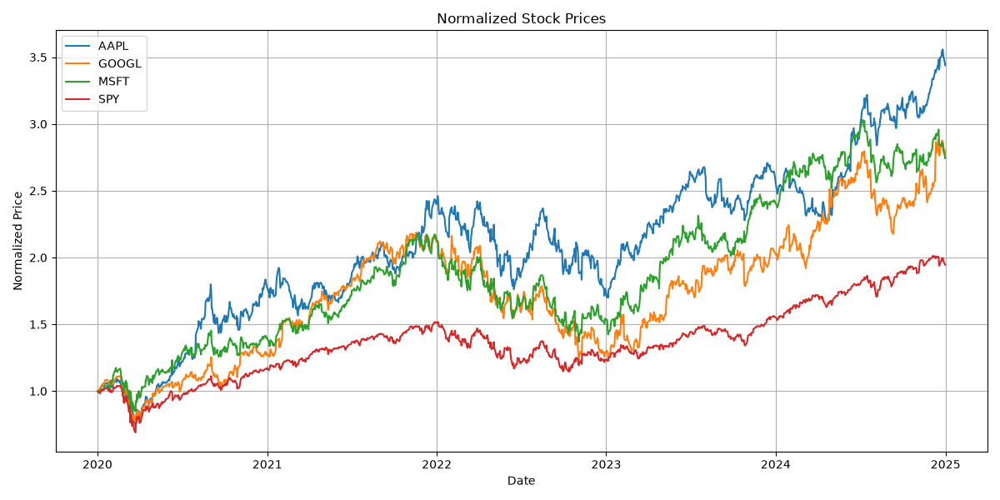
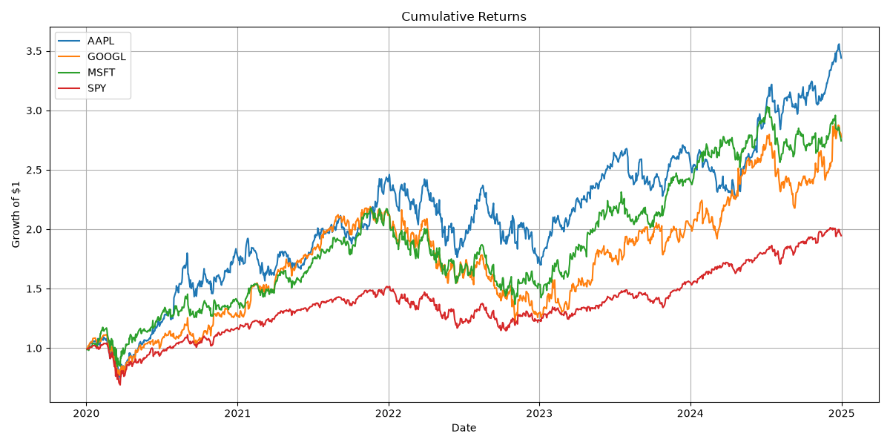
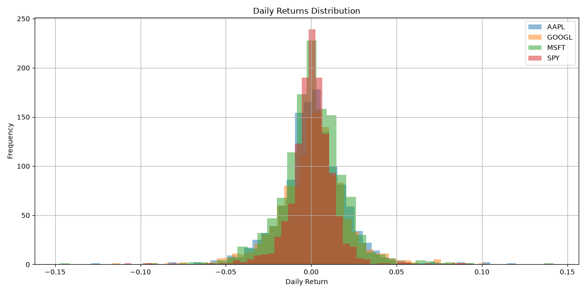
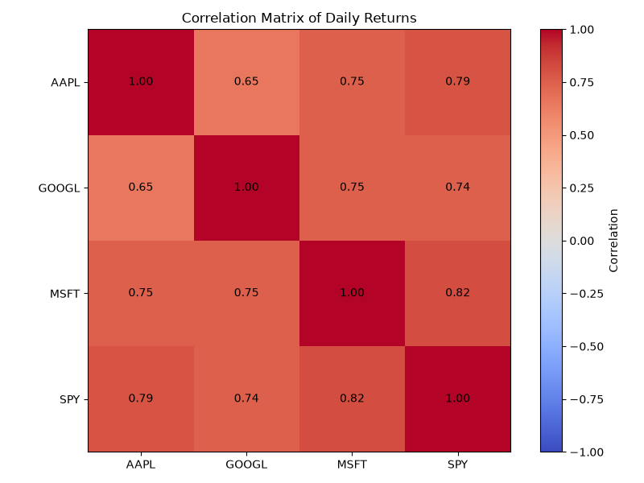
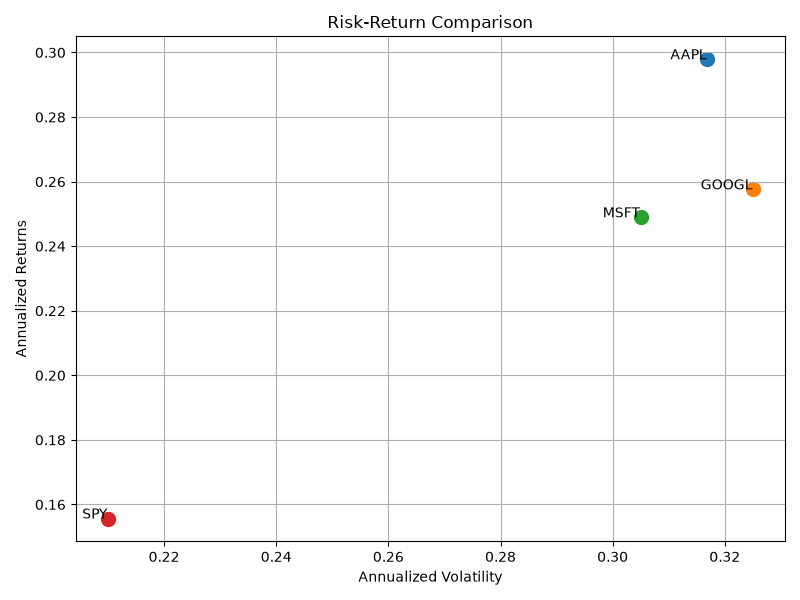

# Multiple Stock Comparison

## Project Overview

This project compares the historical performance of multiple stocks and a market benchmark using Python.

## Assets Analaysed

- AAPL
- MSFT
- GOOGL
- SPY

## Tools Used

- Python
- pandas
- NumPy
- matplotlib
- yfinance

## Key Concepts

### Normalised Price

Normalised prices allow different assets to be compared from the same starting point.

### Daily Return

The percentage change in price from one trading day to the next.

### Cumulative Return

Cumulative return shows how the value of an initial investment changes over time.

### Correlation

Correlation measures how similarly different assets move.

## Results

### Normalized Prices

### Cumulative Returns

### Daily Returns Distribution

### Correlation Matrix

### Risk-Return Scatter

## What I Learned

- How to use pandas DataFrames with multiple columns

## Limitations

- It does not predict future returns
- It ignores dividendsl, transaction costs, and taxes
- Sharpe ratio is calculated using a simplified risk-free rate of 0
